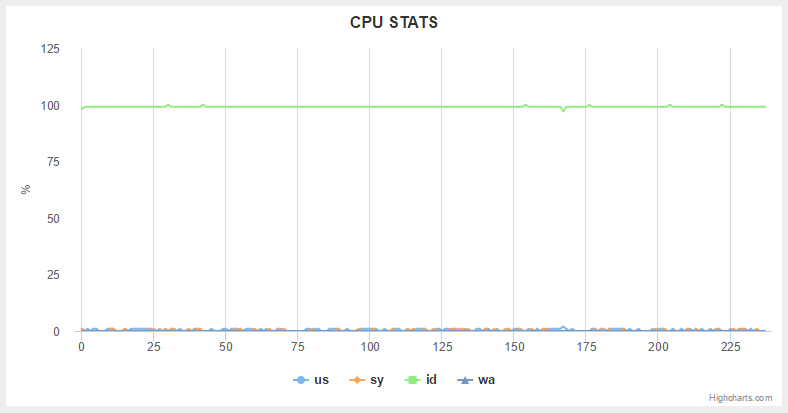
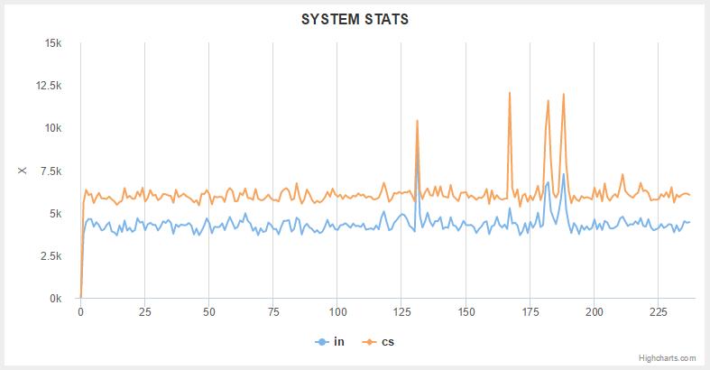

# vmstatly

Generate charts from `vmstat` output.

This app parses the output of `vmstat` linux command (http://linux.die.net/man/8/vmstat) and creates charts from the data.

## Examples

The following graphs show data of a file created with:

`vmstat 1 > vmstat.txt` (You can find that file in the examples directory).

CPU:

Input/Output stats:

System stats:

